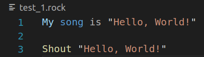
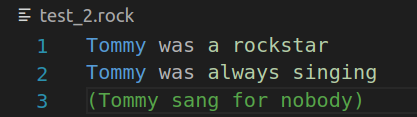
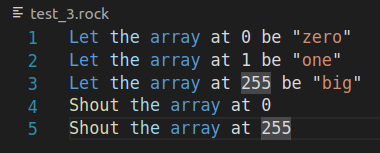
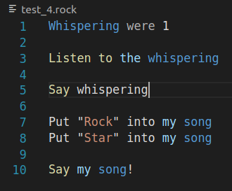
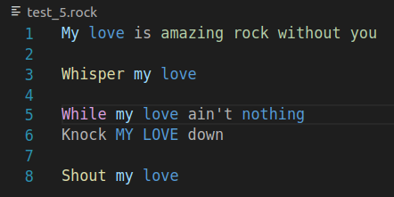
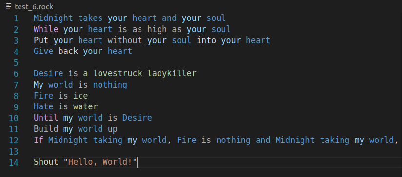

# Test case 1

Test to check  common variable and shout function.

Syntaxis highlighted correctly.

# Test case 2

Test to check simple variable and comments.

Syntaxis highlighted correctly.

# Test case 3

Test to check arrays.

Syntaxis highlighted correctly.

# Test case 4

Test to check highlighting in variabe reassignment and put.

Put wasn't highlighted. Didn't highlighted whispering in Say whispering!

# Test case 5

Check highlighting in cycles.

Knock was not highlighted. Incorrect highlighting for MY LOVE (meant to be same as my love)

# Test case 6

Big test that meant to test highlighting in complex programms.

Midnight function was not highlighted in all places. Build, Put and as high as also were not highlighted.